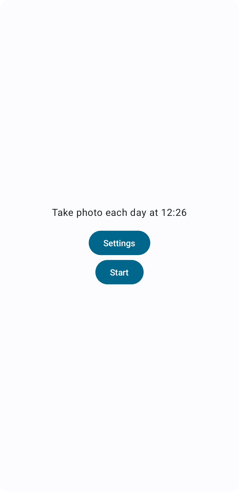
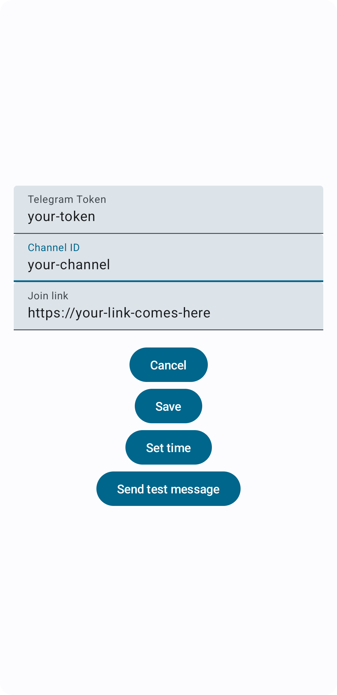
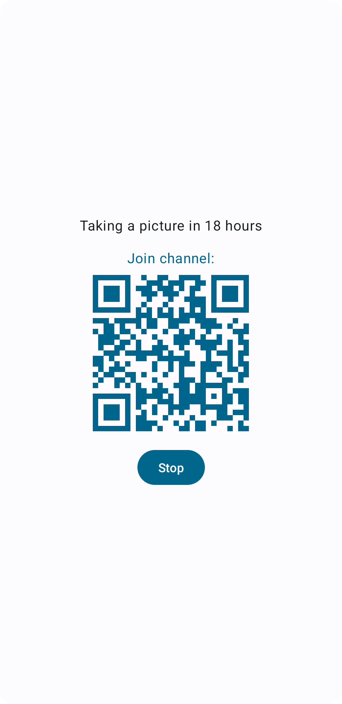

# App preview

  
  
  

# Setting up

Install android studio; upload the app to android phone.

Create a telegram channel and get token and channelId.

Open app settings tab and fill in:
- telegram token
- telegram channelId
- set the time when you want images to be sent
- optionally, add an invite link so it will show a QR code to join the channel while running
- click "send test message". You will need to grant camera permissions

Hang the phone somewhere and click "start".

Now it will take pictures and send the image to the telegram channel!
